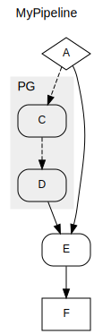
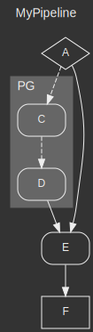
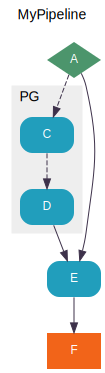
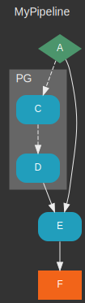

# pipen-diagram

Draw pipeline diagrams for [pipen][1].

## Features

- Diagram theming
- Hiding processes from diagram

## Configurations

- `diagram_theme`: The name of the theme to use, or a dict of a custom theme.
  - See `pipen_diagram/diagram.py` for the a theme definition
  - See [https://graphviz.org/][2] for theme items
- `diagram_loglevel`: The log level of the diagram
- `diagram_savedot`: Whhether to save the dot file (for debugging purpose)
- `diagram_hide`: Process-level item, whether to hide current process from the diagram

## Installation

```shell
pip install -U pipen-diagram
```

## Enabling/Disabling the plugin

The plugin is registered via entrypoints. It's by default enabled. To disable it:
`plugins=[..., "no:diagram"]`, or uninstall this plugin.

## Usage

`example.py`

```python
from pipen import Proc, Pipen, ProcGroup


class A(Proc):
    """Process A"""
    input = "a"


class B(Proc):
    """Process B"""
    requires = A
    input = "b"
    plugin_opts = {"diagram_hide": True}


class PG(ProcGroup):
    """Process Group"""
    @ProcGroup.add_proc
    def c(self):
        """Process C"""
        class C(Proc):
            input = "c"

        return C

    @ProcGroup.add_proc
    def c1(self):
        """Process C1"""
        class C1(Proc):
            requires = self.c
            input = "c1"
            plugin_opts = {"diagram_hide": True}

        return C1

    @ProcGroup.add_proc
    def d(self):
        """Process D"""
        class D(Proc):
            input = "d"
            requires = self.c1

        return D


pg = PG()
pg.c.requires = B


class E(Proc):
    """Process E"""
    input = "e1,e2"
    requires = pg.d, A


class F(Proc):
    """Process F"""
    input = "f"
    requires = E


Pipen("MyPipeline").set_start(A).run()
# Dark theme
# Pipen("MyPipeline", plugin_opts={"diagram_theme": "dark"}).set_start(A).run()
```

Running `python example.py` will generate `MyPipeline-output/diagram.svg`:

| Default theme | Dark theme | Fancy theme | Fancy dark theme |
| ------------- | ---------- | ----------- | ---------------- |
|  |  |  |  |

[1]: https://github.com/pwwang/pipen
[2]: https://graphviz.org/
